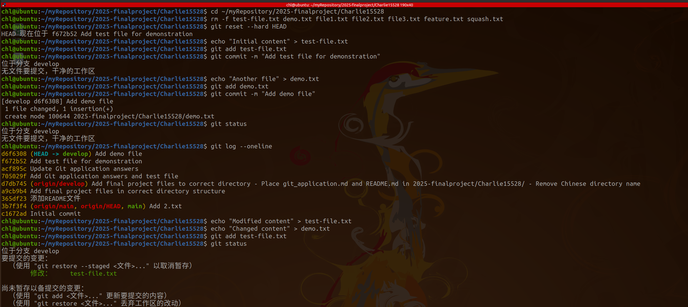
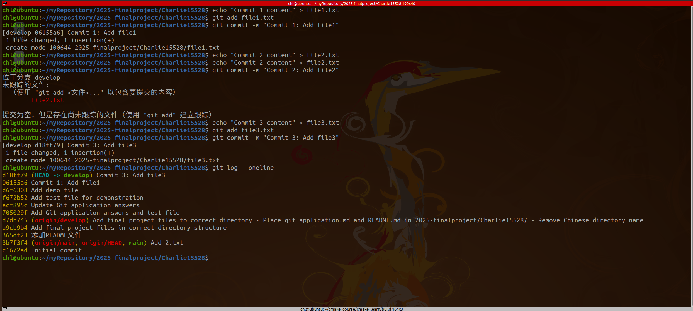
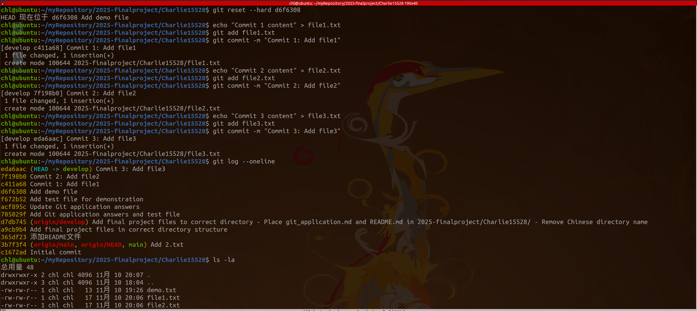
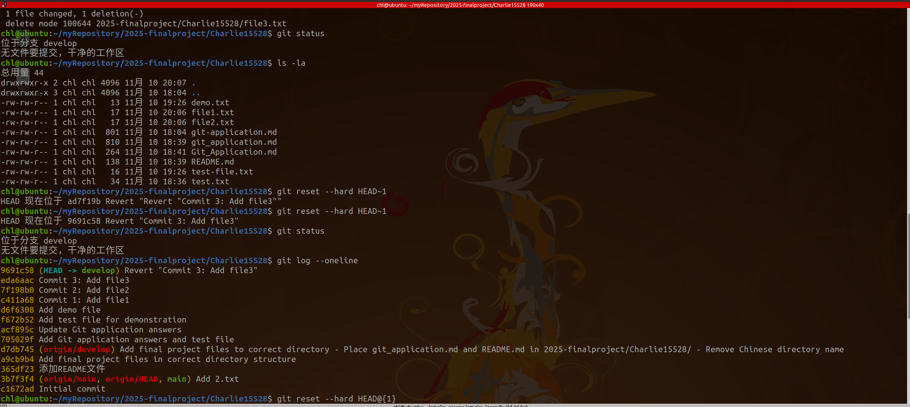
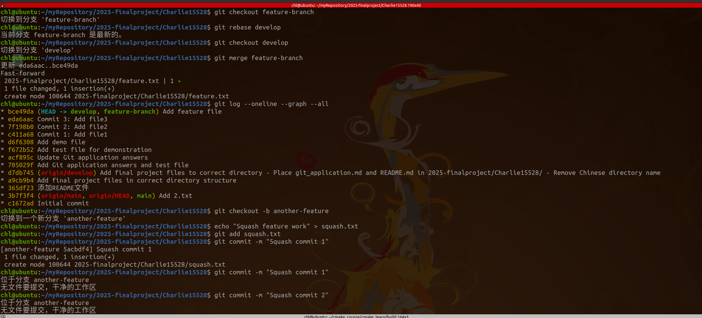
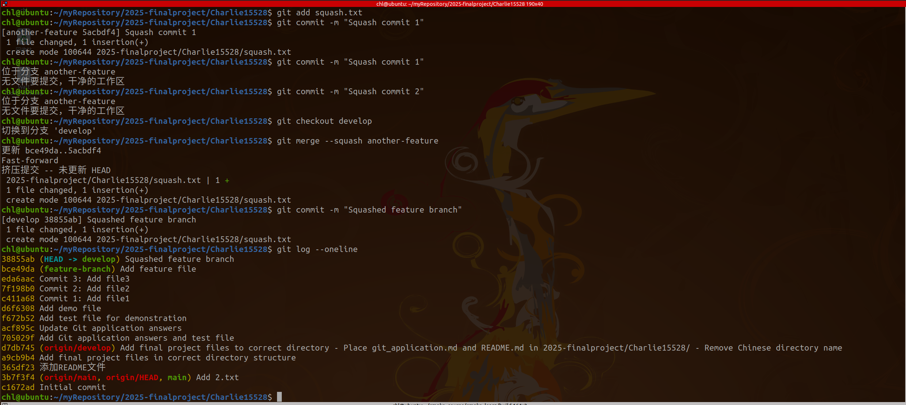

# Git Application Answers

## Question 1: Reverting Modifications

### Method 1: Using git restore
Discard changes in working directory for specific file
git restore <filename>
Discard all changes in working directory
git restore .

### Method 2: Using git reset and git checkout
Unstage files but keep changes in working directory
git reset
Discard all changes in working directory
git checkout -- .

### Method 3: Using git reset --hard
Completely reset to last commit (loses all changes)
git reset --hard HEAD

## Question 2: Reverting Commits

### Without Modifying History:

#### Method 1: Using git revert
Create a new commit that undoes the changes
git revert <commit-hash>
#### Method 2: Using git restore with specific commit
Restore files to previous commit state
git restore --source=HEAD~1 <filename>

### Modifying History:

#### Method 1: Using git reset –soft
Move HEAD back but keep changes staged
git reset --soft HEAD~1

#### Method 2: Using git reset –hard
Completely remove the last commit and all changes
git reset --hard HEAD~1

## Question 3: Branch Merging Methods

### Method 1: Merge Commit
Standard merge creating a merge commit
git checkout main
git merge feature-branch

### Method 2: Rebase and Fast-forward
Rebase feature branch onto main
git checkout feature-branch
git rebase main
Fast-forward merge
git checkout main
git merge feature-branch

### Method 3: Squash Merge
Squash all commits from feature branch into one
git checkout main
git merge --squash feature-branch
git commit -m "Squashed feature branch"

